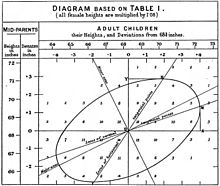
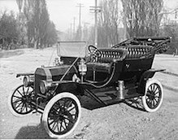
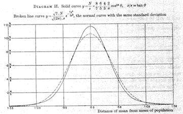
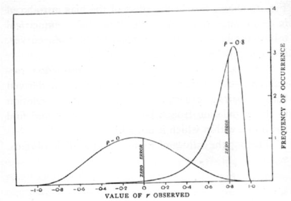

```{r setup, include=FALSE}
knitr::opts_chunk$set(echo = FALSE)
```


# 1880s 

1885 Karl Benz designs 4-stroke engine for use in his automobile

```{r echo = FALSE, out.width = "100%"}
knitr::include_graphics("images/1885Benz.jpg")
```

1888 Francis Galton introduces the "co-relation" coefficient 

```{r echo = FALSE, out.width = "100%"}

```

# 1908 

First Model T off Henry Ford's production line

```{r echo = FALSE, out.width = "100%"}

```

William Gossett's t statistic  

```{r echo = FALSE, out.width = "100%"}

```

# 1920s

1927 Ford Model A enters production

```{r echo = FALSE, out.width = "100%"}
knitr::include_graphics("images/1931_Ford_Model_A_Town_Car_Sedan_Delivery.jpg")
```

1925 ANOVA appears in Fisher's *Statistical Methods for Research Workers* 

```{r echo = FALSE, out.width = "100%"}

```

