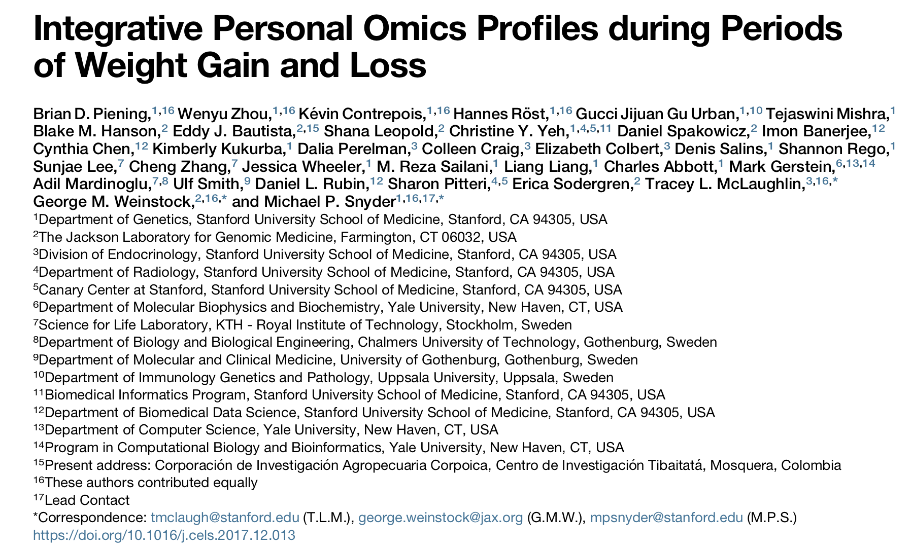

```{r setup, include=FALSE}
knitr::opts_chunk$set(echo = FALSE)
```


# A jungle of names

- Statistics
- Business analytics
- Data science
- Data analysis
- Data mining
- Big data

> Data Scientist (n.):  Person who is better at statistics than any software engineer and better at software engineering than any statistician.

> *I think data-scientist is a sexed up term for a statistician.... Statistics is a branch of science. Data scientist is slightly redundant in some way and people shouldn’t berate the term statistician.* - Nate Silver

> *In short, it’s all about the difference between explaining and predicting. Data analysis has been generally used as a way of explaining some phenomenon by extracting interesting patterns from individual data sets with well-formulated queries. Data science, on the other hand, aims to discover and extract actionable knowledge from the data, that is, knowledge that can be used to make decisions and predictions, not just to explain what’s going on.* -- [Wladawsky-Berger](https://blogs.wsj.com/cio/2014/05/02/why-do-we-need-data-science-when-weve-had-statistics-for-centuries/) "Why Do We Need Data Science When We've Had Statistics for Centuries?". The Wall Street Journal.

> Data science is different from the existing practice of data analysis across all disciplines, which focuses only on explaining data sets. Data science seeks actionable and consistent pattern for predictive uses. This practical engineering goal takes data science beyond traditional analytics. Now the data in those disciplines and applied fields that lacked solid theories, like health science and social science, could be sought and utilized to generate powerful predictive models. - Wladawsky-Berger (May 2, 2014). "Why Do We Need Data Science When We've Had Statistics for Centuries?". The Wall Street Journal.

> The statistics profession faces a choice in its future research between continuing concentration on traditional topics – based largely on data analysis supported by mathematical statistics – and a broader viewpoint – based on an inclusive concept of learning from data.

> The latter course presents severe challenges as well as exciting opportunities. The former risks seeing statistics become increasingly marginal. -- John Chambers (1993)

> Four major influences act on data analysis today:

> 1. The formal theories of statistics
> 2. Accelerating developments in computers and display devices
> 3. The challenge, in many fields, of more and ever larger bodies of data 
> 4. The emphasis on quantification in an ever wider variety of disciplines

-- John Tukey (1962)

* Data Science without statistics is possible, even desirable.
[Vincent Granville](https://www.datasciencecentral.com/profiles/blogs/data-science-without-statistics-is-possible-even-desirable)

* Statistics is the least important part of data science.
[Andrew Gelman](https://statmodeling.stat.columbia.edu/2013/11/14/statistics-least-important-part-data-science/)

#  Example: A weight study

Article in [*Cell Systems*](https://www.cell.com/action/showPdf?pii=S2405-4712%2817%2930555-0)

## Where's the statistician?


```{r echo = FALSE}

```

## n = 80, n_vars_ = 125,000

The first number in (B) is the number of measurements taken on each subject.

```{r echo = FALSE}

```

> *Our study revealed a number of important findings, including (1) modest weight gain in overweight humans was associated with the activation of inflammatory signatures in the blood, induction of markers and pathways for cardiovascular disease, and significant changes to the microbiome; (2) many of these changes affected IR participants differently from metabolically healthy controls (e.g., microbiome and metabolome differences); (3) the **longitudinal nature of the designed perturbation results in statistical power increases** that are equivalent to orders-of-magnitude larger cross-sectional studies, an important consideration for the design of future large-scale (and costly) multi-omics studies.*

# Articles

* Tukey, [The Future of Data Analysis](Tukey-data-analysis.pdf)
* Mosteller and Tukey’s 1968 title reiterated this point: “Data Analysis, including Statistics”.
* Cleveland, [Data Science: An Action Plan for Expanding the Technical Areas of the Field of Statistics](WCleveland-datascience.pdf)
* Chambers, Greater or Lesser Statistics, A Choice for Future Research
* Breiman, [Statistical Modeling: The Two Cultures](breiman.pdf)
* Donoho, [50 years of data science](50YearsDataScience.pdf)

* Berkeley [data science program](https://datascience.berkeley.edu/academics/curriculum/), which has a [Statistics for Data Science](https://datascience.berkeley.edu/academics/curriculum/statistics-for-data-science/) course


# Cleveland's six areas

#. Multidisciplinary investigations (25%)
#. Models and Methods for Data (20%)
#. Computing with Data (15%)
#. Pedagogy (15%)
#. Tool Evaluation (5%)
#. Theory (20%)

# [50 years of data science](50YearsDataScience.pdf)

1. Data exploration and presentation
2. Data representation and transformation
3. Computing with data
4. Data modeling
5. Data visualization and presentation
6. Science about data science

# Gelman, Statistics, and Data Science

[Statistics is the least important part of data science](https://statmodeling.stat.columbia.edu/2013/11/14/statistics-least-important-part-data-science/)

... I was at a meeting the other day ... where people were discussing how statistics fits into data science. Statistics is important  -- don’t get me wrong -- statistics helps us 

* correct biases from nonrandom samples (and helps us reduce the bias at the sampling stage), 
* estimate causal effects from observational data (and helps us collect data so that causal inference can be performed more directly), 
* regularize so that we’re not overwhelmed by noise (that’s one of my favorite topics!), 
* fit models, 
* visualize data and models and patterns. 

Statistics can do all sorts of things. I love statistics! But it’s not the most important part of data science, or even close.


# Data Exploration and Preparation. 

Some say that 80% of the effort devoted to data science is expended by diving into or becoming one with one’s messy data to learn the basics of what’s in them, so that data can be made ready for further exploitation. We identify two subactivities:

* Exploration. Since John Tukey’s coining of the term ‘Exploratory Data Analysis’ (EDA), we all agree that every data scientist devotes serious time and effort to exploring data to sanity-check its most basic properties, and to expose unexpected features. Such detective work adds crucial insights to every data-driven endeavor.

* Preparation. Many datasets contain anomalies and artifacts.30 Any data-driven project requires mindfully identifying and addressing such issues. Responses range from refor- matting and recoding the values themselves, to more ambitious pre-processing, such as grouping, smoothing, and subsetting. Often today, one speaks colorfully of data cleaning.

# Data Representation and Transformation. 

A data scientist works with many different data sources during a career. These assume a very wide range of formats, often idiosyncratic ones, and the data scientist has to easily adapt to them all. Current hardware and software constraints are part of the variety because access and processing may require careful deployment of distributed resources.

Data scientists very often find that a central step in their work is to implement an appropriate transformation restructuring the originally given data into a new and more revealing form.
Data Scientists develop skills in two specific areas:

* Modern Databases. The scope of today’s data representation includes everything from homely text files and spreadsheets to SQL and noSQL databases, distributed databases, and live data streams. Data scientists need to know the structures, transformations, and algorithms involved in using all these different representations.
* Mathematical Representations. These are interesting and useful mathematical structures for representing data of special types, including acoustic, image, sensor, and network data. For example, to get features with acoustic data, one often transforms to the cepstrum or the Fourier transform; for image and sensor data the wavelet transform or some other multi scale transform (e.g. pyramids in deep learning). Data scientists develop facility with such tools and mature judgement about deploying them.

# Computing with Data 

Every data scientist should know and use several languages for data analysis and data processing. These can include popular languages like R and Python, but also specific languages for transforming and manipulating text, and for managing complex computational pipelines. It is not surprising to be involved in ambitious projects using a half dozen languages in concert.

Beyond basic knowledge of languages, data scientists need to keep current on new idioms for efficiently using those languages and need to understand the deeper issues associated with computational efficiency.

Cluster and cloud computing and the ability to run massive numbers of jobs on such clusters has become an overwhelmingly powerful ingredient of the modern computational landscape. To exploit this opportunity, data scientists develop workflows which organize work to be split up across many jobs to be run sequentially or else across many machines.

Data scientists also develop workflows that document the steps of an individual data analysis or research project.

# Data Visualization and Presentation 

Data visualization at one extreme overlaps with the very simple plots of EDA - histograms, scatterplots, time series plots - but in modern practice it can be taken to much more elaborate extremes. Data scientists often spend a great deal of time decorating simple plots with additional color or symbols to bring in an important new factor, and they often crystallize their understanding of a dataset by developing a new plot which codifies it. Data scientists also create dashboards for monitoring data processing pipelines that access streaming or widely distributed data. Finally they develop visualizations to present conclusions from a modeling exercise or CTF challenge.

Finally, data scientists develop packages that abstract commonly-used pieces of workflow and make them available for use in future projects.

# Data Modeling. 

Each data scientist in practice uses tools and viewpoints from both of Leo Breiman’s modeling cultures:

* Generative modeling, in which one proposes a stochastic model that could have generated the data, and derives methods to infer properties of the underlying generative mechanism. This roughly speaking coincides with traditional Academic statistics and its offshoots. 31

* Predictive modeling, in which one constructs methods which predict well over some some given data universe – i.e. some very specific concrete dataset. This roughly coincides with modern Machine Learning, and its industrial offshoots.

# Science about Data Science

Tukey proposed that a ‘science of data analysis’ exists and should be recognized as among the most complicated of all sciences. He advocated the study of what data analysts ‘in the wild’ are actually doing, and reminded us that the true effectiveness of a tool is related to the probability of deployment times the probability of effective results once deployed.

Data scientists are doing science about data science when they identify commonly-occuring analysis/processing workflows, for example using data about their frequency of occurrence in some scholarly or business domain; when they measure the effectiveness of standard workflows in terms of the human time, the computing resource, the analysis validity, or other performance metric, and when they uncover emergent phenomena in data analysis, for example new patterns arising in data analysis workflows, or disturbing artifacts in published analysis results.

The scope here also includes foundational work to make future such science possible – such as encoding documentation of individual analyes and conclusions in a standard digital format for future harvesting and meta analysis.

As data analysis and predictive modelling becomes an ever more widely distributed global enterprise, ‘Science about Data Science’ will grow dramatically in significance.

